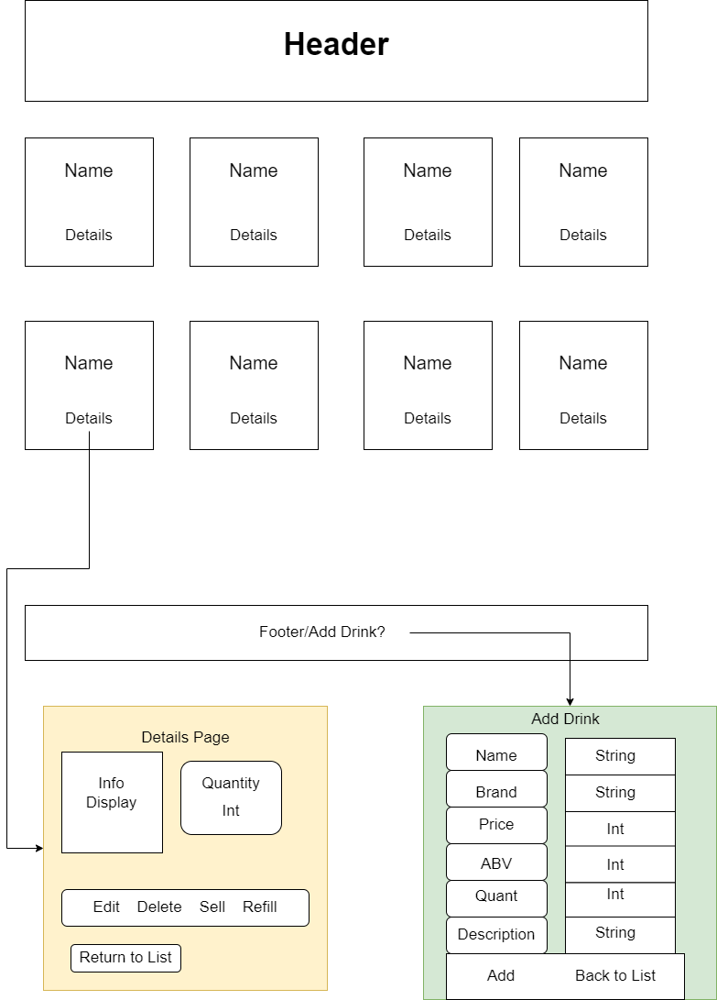

# Tap Room  

#### An application that allows a user to add drinks and edit different properties of those drinks in a tap room menu.  

#### Created By: Brandon Eads  

## Technologies Used

* CSS
* HTML
* JavaScript
* React.js
* Node.js
* Bootstrap Framework for CSS and JavaScript
* React-Bootstrap  

## Description

This application allows the user to create a drink menu for a tap room. It includes the ability to add a name, brand, price, quantity of pints in a keg(124 by default), alcohol by volume and a description for their drink. All added drinks are displayed on the main page and a "details" button is provided to open each one individually to view the previous inputs. A user can edit and delete a drink, or add and subtract a pint from the total displayed. If the total pints are equal to or less than 10, the counter message changes to inspire urgency in ordering that particular drink. If the total pints are 0, the "sell" button is greyed out and replaced with a disabled "Out of Stock" button. Vice versa, if there are the maximum of 124 pints, the "add" button is greyed out and replaced with a disabled "Full" button.  

## Visualization

The following example shows the intended display properties of this project.

  

## Setup and Usage Instructions

### Technology Requirements

* Download and install a code text editor. Ex: [VS Code](https://code.visualstudio.com/)  

### Installation

* Clone [this](https://github.com/beads89/tap-room) repository, or download and open the Zip on your local machine
* Open the tap-room folder in your preferred text editor
* To install required packages, navigate to the tap-room directory in the terminal and type the following command:
  - npm install

* To run the project:
  - Navigate to the tap-room folder in the command line or terminal
    - Run the command "npm start"  

## Known Bugs

* Drinks do not show up as side by side columns as expected.  

### License

[MIT License](https://opensource.org/licenses/MIT)
Copyright 2021 Brandon Eads

## Support and contact details

* [Brandon Eads](github.com/beads89) <Brandon181989@hotmail.com>

### Deployment

This section has moved here: [https://facebook.github.io/create-react-app/docs/deployment](https://facebook.github.io/create-react-app/docs/deployment)

